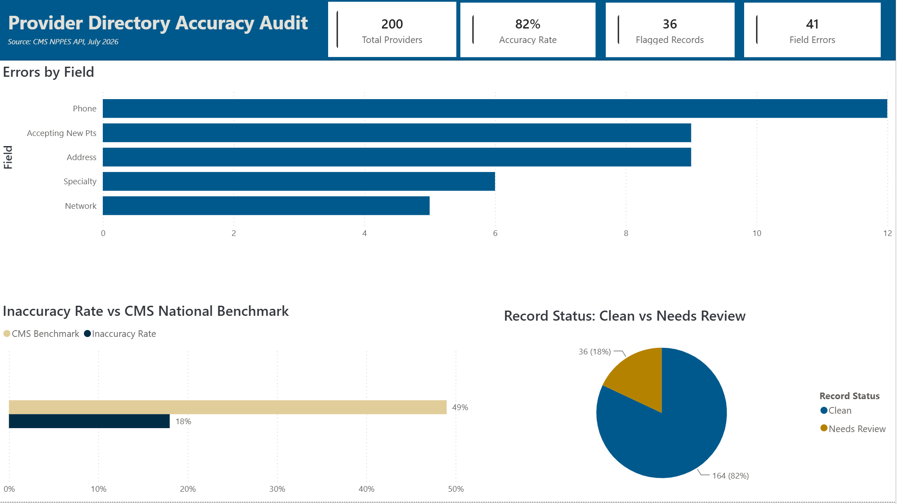
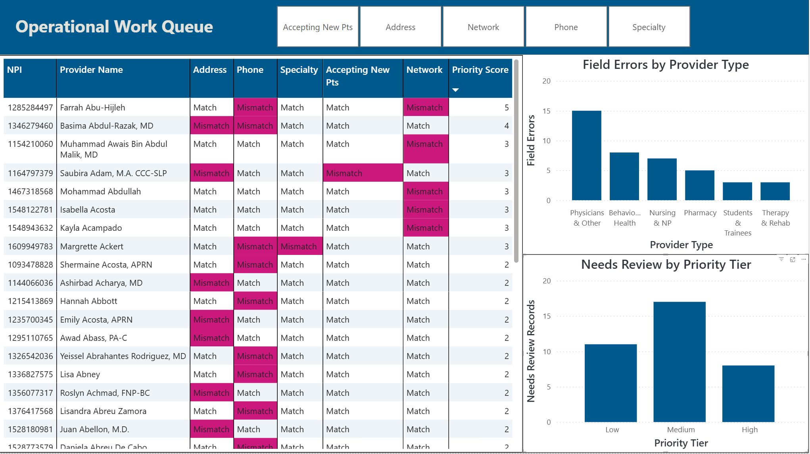

# Provider Directory Accuracy Audit

An Excel and Power BI project that reconciles provider source data against a simulated directory output to identify and quantify data quality discrepancies.

## Why This Matters

Health plans are required to keep provider directories accurate. CMS national reviews have found that roughly half of provider directory locations contain at least one inaccuracy, most commonly wrong phone numbers, incorrect addresses, or outdated patient acceptance status. Under the No Surprises Act, plans must verify every provider record at least once every 90 days and process updates within two business days. This project simulates that reconciliation process, comparing a provider source dataset against a directory output to identify discrepancies and measure accuracy against industry compliance benchmarks.

## Data Sources

**Provider Source Data:** Pulled from the NPPES (National Plan and Provider Enumeration System) API, the official public registry maintained by CMS for every healthcare provider in the United States. This served as the source of truth for provider name, specialty, and practice address.

**Directory Output Data:** Simulated for this project. Real member facing directories are not publicly available in a comparable format, so a copy of the source data was modified to introduce realistic errors, matching the error types identified in CMS's own provider directory audits (wrong phone numbers, incorrect addresses, incorrect specialty listings, and inaccurate network or patient acceptance status).

## Methodology

1. Pulled 200 individual provider records (NPI-1) from the NPPES API for the Orlando, FL metro area.
2. Created a duplicate dataset to represent the directory output, and introduced errors into 18% of records across five fields: phone number, address, specialty, network status, and patient acceptance status.
3. Used XLOOKUP to match records between the two tables on NPI (National Provider Identifier), the unique ID assigned to every provider, and built comparison columns to flag mismatches field by field.
4. Applied conditional formatting to visually flag every discrepancy, and quantified results on a formula-driven Summary sheet benchmarked against CMS audit findings.
5. Brought the cleaned data into Power BI to build a two page report: an executive summary view and an operational work queue view.

## Key Findings

- 36 of 200 provider records (18.0%) contained at least one discrepancy, with 41 field-level errors in total.
- Phone numbers were the most common error (12 records), consistent with CMS audit findings, followed by addresses (9), patient acceptance status (9), specialty listings (6), and network status (5).
- Record-level accuracy of 82.0% is well above the industry baseline observed in CMS's national directory audits (roughly half of locations had at least one inaccuracy), but that baseline is an observed error rate, not a compliance target: directory accuracy is effectively zero-tolerance under the No Surprises Act, and at this error rate a 10,000-provider directory would still carry roughly 1,800 inaccurate listings.
- Under the No Surprises Act two-business-day update requirement, the 36 flagged records form the operational work queue in the Power BI report, prioritized by a weighted risk score: network status errors rank highest (a false in-network listing triggers No Surprises Act cost-sharing liability for the plan), followed by phone and address errors (which block members from reaching care), then acceptance and specialty listing errors.

## Report Preview

**Executive Summary** — KPIs, errors by field, and inaccuracy rate vs the CMS national benchmark:

**Operational Work Queue** — flagged records sorted by weighted risk score, with field-level slicers, provider type breakdown, and priority tiers:

## Tools Used

Excel (NPPES API data pull, XLOOKUP, conditional formatting, formula-driven audit summary), Power BI (Power Query, star schema modeling, DAX)

## Files

- [Provider_Directory_Audit.xlsx](Provider_Directory_Audit.xlsx) — source data, directory output, XLOOKUP audit, and summary 
- [Provider_Directory_Audit.pbix](Provider_Directory_Audit.pbix) — two-page Power BI report: executive summary and operational work queue 
